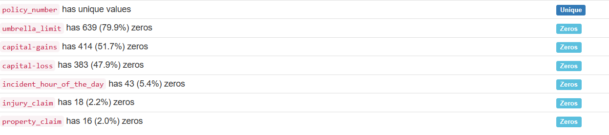
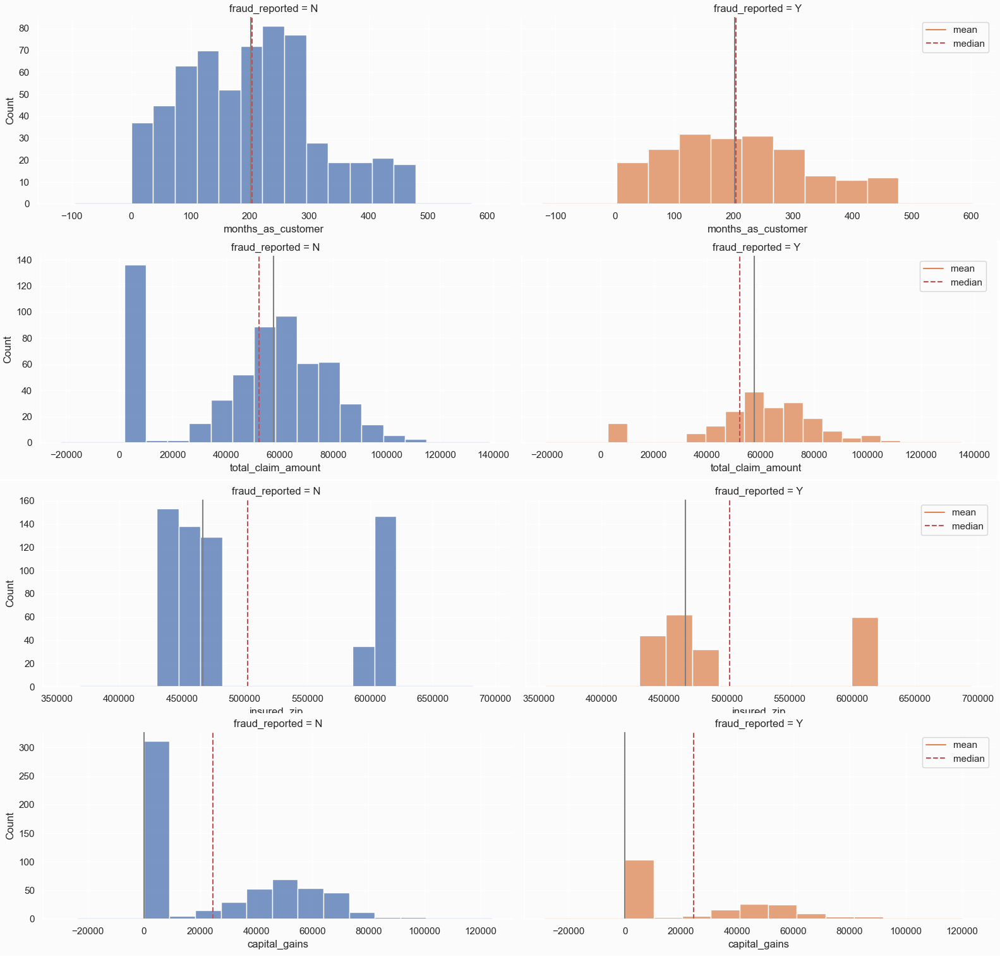
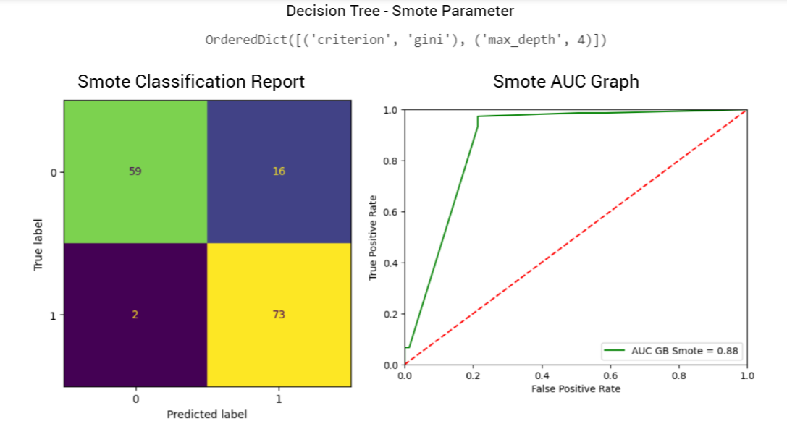
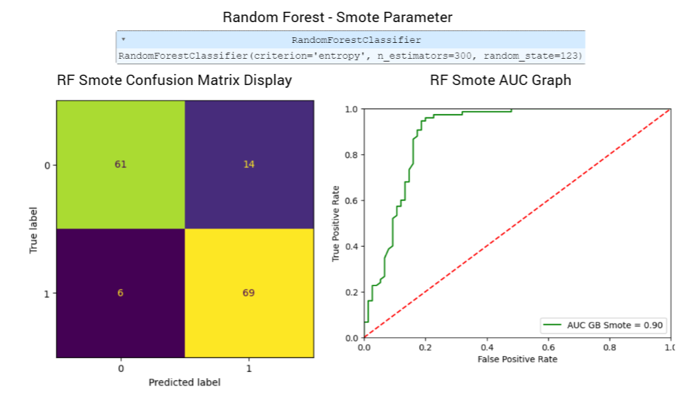
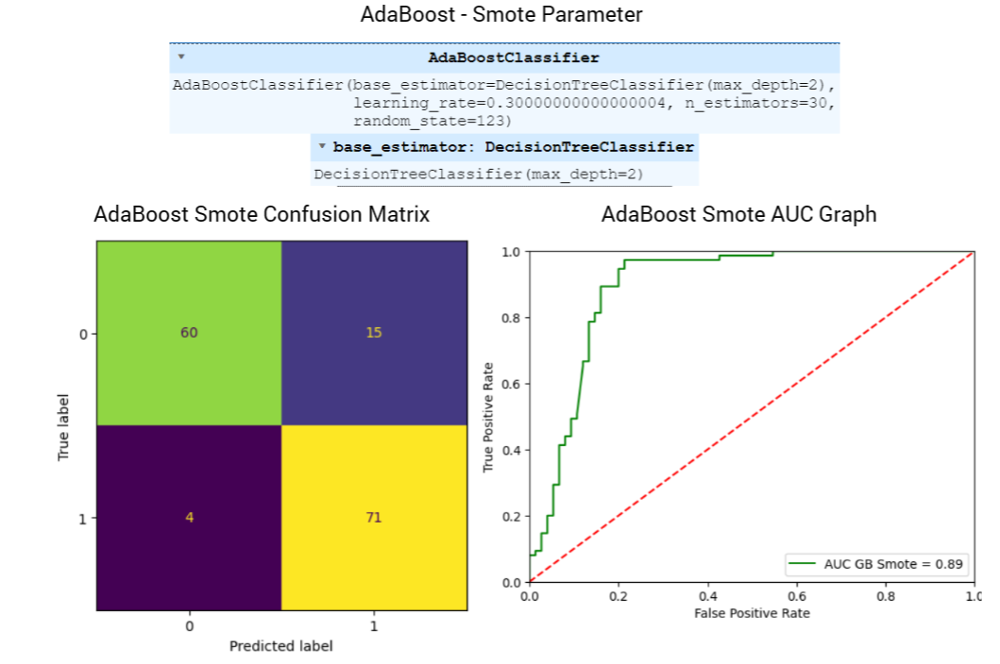
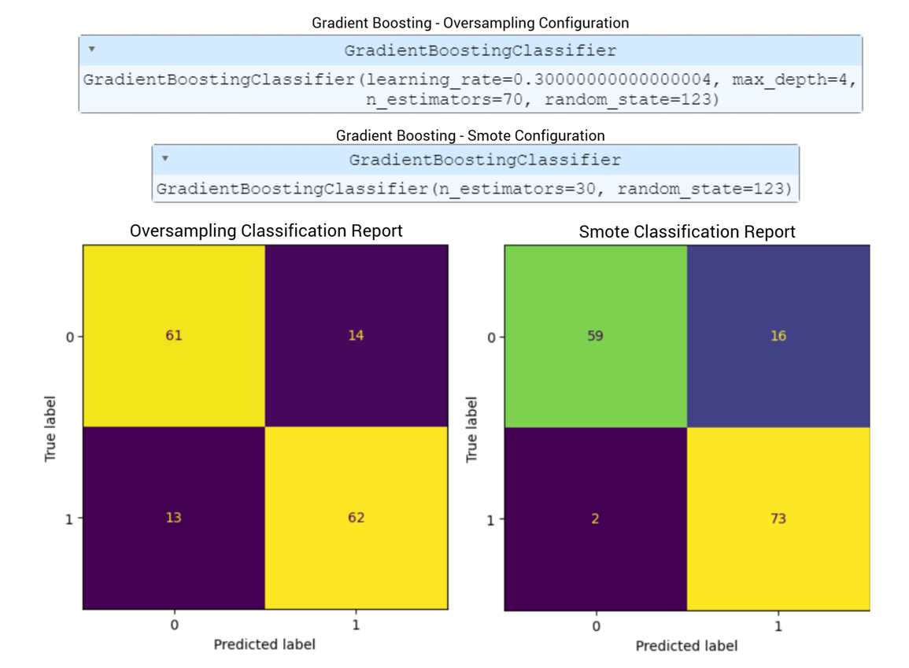
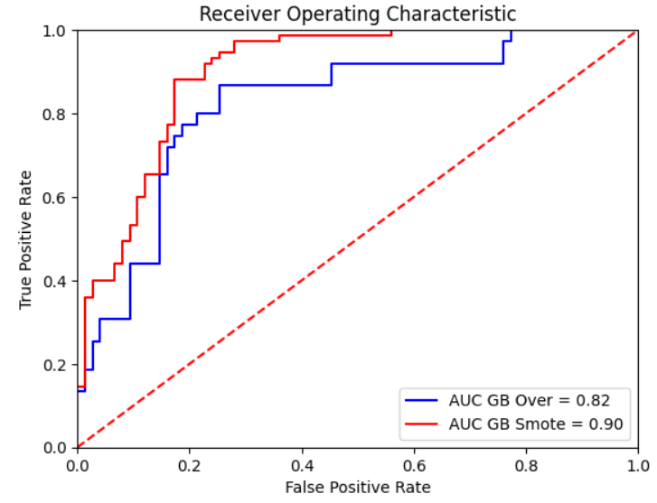
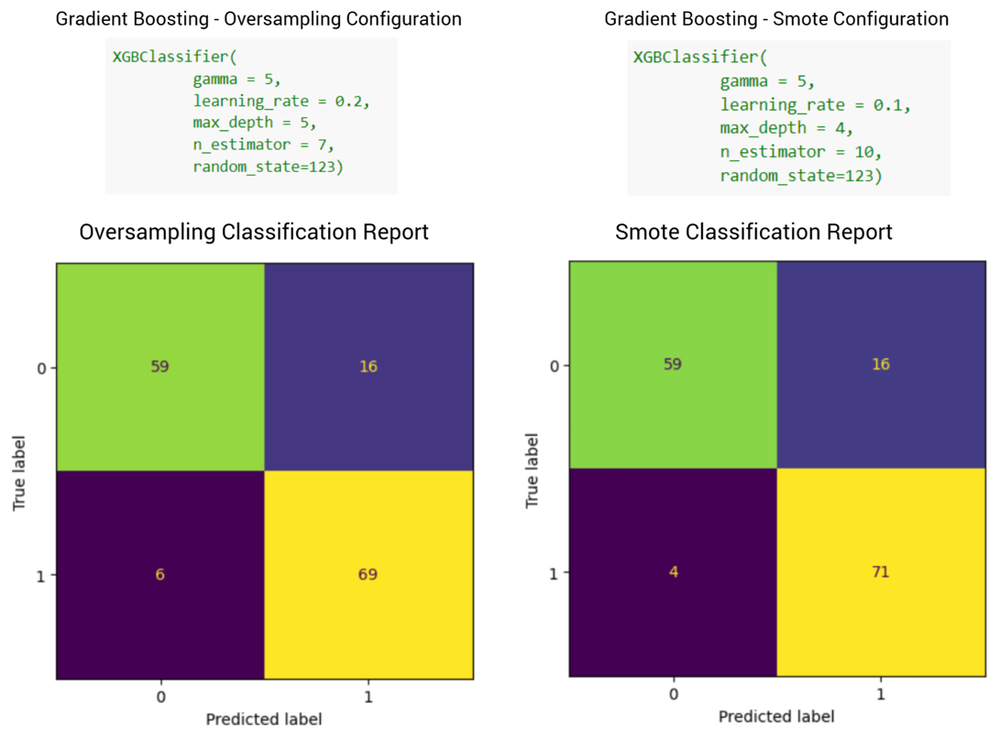
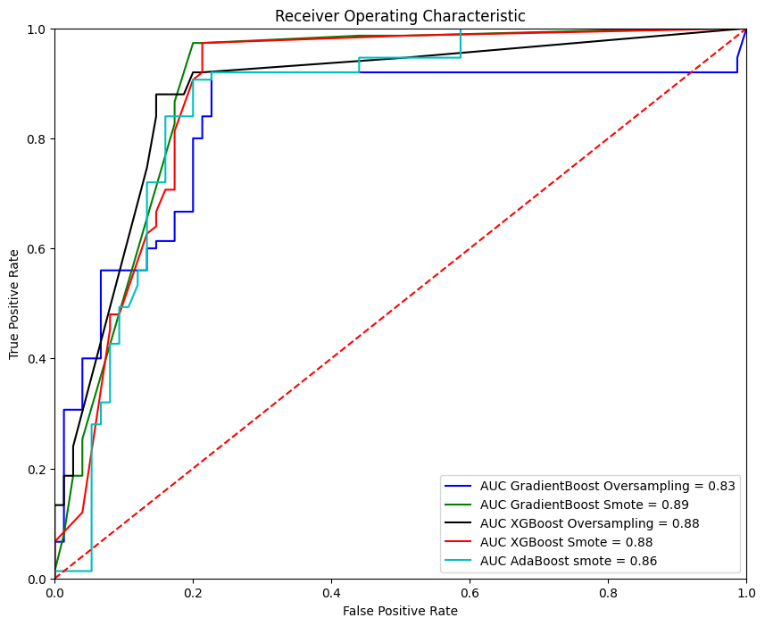
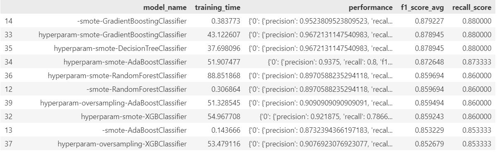

<!-- About The Project -->

<a name="readme-top"></a>

<!-- TABLE OF CONTENTS -->

<summary>Table of Contents</summary>
<ol>
  <li><a href="#about-the-project">About The Project</a></li>
  <li><a href="#business-objective">Business Objective</a></li>
  <li><a href="#business-metrics">Business Metrics</a></li>
  <li><a href="#getting-started">Getting Started</a></li>
  <li>
    <a href="#data-workflow">Data Workflow</a>
    <ul>
      <li><a href="#dataset">Dataset</a></li>
      <li><a href="#data-preparation">Data Preparation</a></li>
      <li><a href="#data-preprocessing-and-feature-engineering">Data Preprocessing and Feature Engineering</a></li>
      <li><a href="#data-modelling">Data Modelling</a></li>      
    </ul>
  </li>
  <li>
    <a href="#prediction-using-api-and-streamlit">Prediction using API and Streamlit</a>
    <ul>
      <li><a href="#how-to-run-by-api?">How To Run by API?</a></li>
      <li><a href="#data-input">Data Input</a></li>
    </ul>
  </li>
</ol>

<!-- About the Project -->
# About the Project

<p align=left>
<a href="https://medium.com/@dandi.mahendris/fraud-binary-classification-on-auto-insurance-claims-8ff402686a6f">
  
</a>
</p>

# Auto Insurance Fraud Detection

<p align=center>

</p>

Frauds are known to be dynamic and have no patterns, hence they are not easy to identify. Amount claimed by fraudulent is significantly huge that may lead to serious loss of money. Such frauds occurred in all areas of insurance claim with high severity including auto sectors that widely claimed by fake accident claim. 

The project applying multiple ML techniques to label and classify fraud claim. Before applying any ML model, we use exploratory data analysis to find how the categoric and numeric features relationship toward target (fraud classification), as well as **feature selection** are used such as ***Chi-squared test*, *Shapiro-Wilk*, *Probability Plot, Welch's Test, Person Correlation, Lasso* Method, *XGBoost* feature importance** and ***Random Forest* feature importance**.

In preprocessing technique, dataset encountered with unpleasant task of high **imbalanced data** of fraud and non-fraud case. Hence, Oversampling and SMOTENC are applied toward dataset, and we will have 3 type of configuration data such as **Non-Balanced, *Oversampling*** and ***SMOTENC***.

The datasets using Auto Insurance Industry and will approached the ***accuracy*, *precision*, *recall*** on ***confusion* *matrix*** and also the ***Area Under the ROC Curve (AUC)*** as the evaluation metrics that would be used.

<!-- Business Objective -->
## Business Objective
This research goal is to build binary classifier model which are able to predict fraud transactions. We present our conclusions based on an empirical study comparing different ML models and classification metrics such **Recall** and **AUC Score**.

<!-- Business Metrics -->
## Business Metrics

**Precision** and **recall** should be chosen as the one of the evaluation metrics in classification models.

<p align=center>

</p>

**`Precision`** is the rate of true positives divided by the sum of true positives and false positives. **`Recall`** is the number of true positives divided by the sum of true positives and false negatives.
A high recall indicates the model is able to classify relevant (positive) results without mislabeling them as irrelevant (negative). On the other hand, high precision indicates the model is able to returned positives predicted values is correctly positives with low irrelevant results (incorrectly positives).

Recall score with low False Negative and high False Positive Rate in AUC score should be parameter to select best model.

<p align=center>

</p>

**AUC Score** is also another consideration to choose the best model. <br/>
**`ROC`** is an evaluation metric for binary classification problems and a probability curve that plots the **TPR** againts **FPR** at various threshold values. <br/>
An excellent model has AUC near to the 1 which means it has a good measure of separability. A poor model has an AUC near 0 which means it has the worst measure of separability

<p align="right">(<a href="#readme-top">back to top</a>)</p>

## Related Works
Zareapoor and Shamsolmoali (2015) applied different type of Machine Learning technique namely Naïve Bayes, KNN, SVM, and Bagging Ensemble Classifier toward Fraud Detection. They stated most of the time real world fraud data is highly unbalanced since the fraudulent transactions only 2% out of 100%. Another major challenges which frequently reported in many research is about the dynamic patterns of fraud transactions. The methodology they using split the dataset into 4 different sets containing 20% fraud, 15% fraud, 10% fraud, and 3% fraud. They used True Positive Rate (TPR), True Negative Rate (TNR), False Positive Rate (FPR) and False Negative Rate (FNR) as the evaluation metrics in these cases since the accuracy of error rate was not the best one to handle imbalanced datasets. The final results is KNN models had much better false alarm rate and fraud catching compare to the others.

<!-- GETTING STARTED -->
## Getting Started

1. Clone the repository
```sh
$ git clone https://github.com/DandiMahendris/Auto-Insurance-Fraud-Detection.git`
```
2. Install requirement library and package on `requirements.txt`

3. If you want to create the folder instead

```sh
$ mkdir folder
$ git init
```

4. remote the repository
```sh
$ git remote add origin git@github.com:DandiMahendris/Auto-Insurance-Fraud-Detection.git
$ git pull origin main
```

<p align="right">(<a href="#readme-top">back to top</a>)</p>

<!-- Data Workflow -->
# Data Workflow

## Dataset

In this study, we have used Kaggle provided dataset of Auto Insurance Claim contains 1000 rows and 40 columns shape.

| Column Name              | Describe                                      |
| :----------------------- | :-------------------------------------------- |
| *Policy_annual_premium*    | Amount of insured need to pay over the year   |
| *Insured_zip*              | Insured number                                |
| *Capital-gains*            | Profit on earns of the sales                  |
| *Capital-loss*             | Loss incurred                                 |
| *Incident_hour of the day*| Hour of the day incident occurred             |
| *Total claim amount*      | Total Amount of claims                        |
| *Injury claim*            | Amount of injury claims                       |
| *Property claim*           | Amount of property claim                      |
| *Vehicle claim*           | Amount of vehicle claim                       |
| *Policy_state*             | State of policy holder                        |
| *Policy_csl*               | Combined single limit of policy               |
| *Policy_deductable*        | Amount of first pay                           |
| *Insured_sex*              | Gender                                        |
| *Insured_hobbies*          | Hobby of insured                              |
| *Incident_type*            | Type of incident occurred                     |
| *Collision_type*           | Type of damaged parts                         |
| *Incident_severity*        | Type of severity damaged                      |
| *Authorities contacted*    | Type of authorities has contacted on incident |
| *Incident_state*           | State of incident                             |
| *Incident_city*            | City of incident                              |
| *Number of vehicle*        | Number of vehicle involved                    |
| *Property damaged*         | Property damaged or not                       |
| *Bodily injuries*         | Number of bodily injured                      |
| *Witnesses*               | Number of witnesses                           |
| *Auto_year*                | Year of auto model                            |
| *Police_report*            | Available or not                              |
| *Auto_make*                | Fabrication of Auto                           |
| *Auto_model*               | Auto model                                    |

<p align="right">(<a href="#readme-top">back to top</a>)</p>

## Data Preparation

<p align=center>

</p>

<p align="right">(<a href="#readme-top">back to top</a>)</p>

Dataset is typically unbalanced data with 247 (0.24%) claims are labeled as fraud transactions out of 753 (0.76%) claims that classify as non-fraud cases. You can easily view the data report on *data_profile_report.html* that provided on my github.

<p align=center>

</p>

A glimpse of small dataset view is shown by picture below

<p align=center>

</p>

<p align=center>

</p>

On this stage after data was prepared by checking data shape and data ranges, we split into train data (70%), validation data (15%), and test data (15%) using `sklearn.model_selection.train_test_split` with `stratify=y` cause we want distribute the imbalanced data on same proportion of each dataset.

```python
x_train, x_test, y_train, y_test = train_test_split(X, y, test_size = 0.2, random_state= 42, stratify= y)

x_valid, x_test, y_valid, y_test = train_test_split(x_test, y_test, test_size = 0.5, random_state= 42, stratify= y_test)
```
<p align="right">(<a href="#readme-top">back to top</a>)</p>

## Data Preprocessing and Feature Engineering

<p align=center>

</p>

### Exploratory Data Analysis

Since we are using classification model with labeled data, we want to check the relation between categorical features or numerical features toward the label features.

#### 1. Histogram
--------------------------

What we look out for:
- Potential <b>outliers</b>
- <b>Numeric features that should be categorical (indicator)</b> features. For example, if there are only two possible values like 0 and 1.
- Boundaries that do not make sense, such as <b>percentage value more than 100</b>.

<p align=center>

</p>

Here we provide 4 histogram of numerical features separated by non-fraud (left) and fraud case (right).
- <b>`insured_zip`</b> are prone into two group of <b><500.000</b> and <b>>600.000</b>
- <b>`capital_gains`</b> is highly <b>left-skewed</b> distributed since it has much zero values (0) 

<p align="right">(<a href="#readme-top">back to top</a>)</p>

#### 2. Kernel Density Plot
-----------------------

KDE plot using `klib.dist_plot` to give better distribution comprehension of numeric features, given <b>mean, median, and standard deviation</b>

<p align=center>

</p>

There are several features in the dataset that exhibit a **`bimodal distribution`**, meaning they have two distinct peaks or modes. These features are strongly **correlated with the amount of money**. Consequently, the **occurrence of a value of 0 in these features creates the bimodal distribution**. The correlation with the amount of money suggests that these features play a significant role in determining the monetary values observed in the dataset.

<p align="right">(<a href="#readme-top">back to top</a>)</p>

#### 3. Boxplot of Numerical Features
---------------------

Here, we will separate the data by the target feature and observe how the numeric features are distributed among those which **fraud (target = 1)** and those which **non-fraud (target = 0)**.

<p align=center>

</p>

We can see that **`month_as_customers, age, insured_zip, capital_gains, capital_loss, incident_hours_of_the_day`** <br>
are almost **equally distributed** among those which non-fraud (target 0) and those which fraud (target 1). <br>
This means that training_hours **might not be a good predictor** for the target. 

However, we see that when it comes to **`policy_annual_premium, total_claim_amount, injury_claim, property_claim, vehicle_claim`**,<br> 
a bigger proportion of those who stayed are tending towards more years of experience and these could be **good predictors**.

<p align="right">(<a href="#readme-top">back to top</a>)</p>

#### 4. Barplot
--------------------

We will create count plots of the data using **Seaborn’s `catplot()`** function and provide **`kind=count`** as a parameter

Notice the parameter **`sharey=False`** in catplot which disassociates the y-scales for each target class so that we can **better view and compare the relationships**.

<p align=center>

</p>

These features show a **significant relationship between target (fraud_reported)**. <br>
Visibly, they **exhibit distinct patterns that are different from each other**. These patterns in the features are strongly associated with the occurrence of fraud, making them crucial indicators for predicting fraudulent activities.

<p align="right">(<a href="#readme-top">back to top</a>)</p>

#### 5. Heatmap Pearson Correlation
---------------

What to look out for:
- Strong relationship between numeric features, drop these features to reduce **redundance (collinearity)** in data.
- **Collinearity** is the state where two variables are highly correlated and contain similar information about the **variance within a given dataset.**

<p align=center>

</p>

To reduce multicollinerity we can drop either **`total_claim_amount`** from the data, since **`total_claim_amount = injury_claim + property_claim + vehicle_claim`**

or the other three **(`injury_claim, property_claim, vehicle_claim`)**

<p align="right">(<a href="#readme-top">back to top</a>)</p>

### Feature Selection

#### 1. Chi-Squared Test (Category toward Label)
---------------

**Null Hypothesis**: The two categorical variables have no relationship (independent) <br>
**Alternate Hypothesis**: There is a relationship between two categorical variables (dependannt)


> <b>H<sub>0</sub></b> : (Feature not important)<br> 
> <b>H<sub>1</sub></b> : (Feature important)

Null Hypothesis is trying to tell the probability of observing data at least as extreme as the ones we've observed is assuming the <b>all categories in features did in reality have the same frequency of fraud.</b>

```python
from scipy.stats import chi2_contingency

X_cat = train_set[list_cat_col].loc[:, ~train_set[list_cat_col].columns.isin(['fraud_reported'])]
y_cat = train_set['fraud_reported']

alpha = 0.05
p_values_ = dict()

for col in X_cat.columns:

    chi2_data = pd.crosstab(X_cat[col], y_cat)

    chi2, p, dof, expected = chi2_contingency(chi2_data)

    p_values_.setdefault('column', []).append(col)
    p_values_.setdefault('p_values', []).append(p)
    p_values_.setdefault('chi2', []).append(chi2)

    if p < alpha:
        p_values_.setdefault('result', []).append('Reject Ho')        

    else:
        p_values_.setdefault('result', []).append('Failed to Reject Ho') 

chi2_data = pd.DataFrame(p_values_).set_index('column')
chi2_data
```

<p align=left>

</p>

Hence we got the features of `insured_hobbies`, `incident_type`, `collision_type`, `incident_severity`, `authorities_contacted`, `incident_state`, `property_damage` which are Failed to Reject H<sub>0</sub>.

<p align="right">(<a href="#readme-top">back to top</a>)</p>

#### 2. Welch's Test (Numeric toward Label)
----------

Before we performed Welch's Test or Two-Way Test, it approriate to check the parametric assumption such as normality using **`Shapiro-Wilk Test`** and **`Probability Q-Q Plot`** and Equal Variance using **`Levene Test`**.

        Equal Variance would perform Independence T-Test.
        Non-Equal Variance would perform Welch's Test.

-------------------------
        H0 : There's no difference mean between var1 and var2,
        H1 : There's difference mean between var1 and var2,
>**H₀ : μ₁ = μ₂** <br>

>**H₁ : μ₁ ≠ μ₂**
<br>

```python
import scipy
from scipy.stats import ttest_ind

for i, ax in zip(list_num_col, axes.flatten()):

    lst_0 = train_set[i][train_set['fraud_reported']=='N']
    lst_1 = train_set[i][train_set['fraud_reported']=='Y']

    degree = lst_0.count() + lst_1.count()

    x = np.arange(-10,10,0.1)

    t_stat, p_value = ttest_ind(lst_0, lst_1, equal_var=False)
    t_crit = scipy.stats.t.ppf(alpha/2, degree)
```

<p align=center>

</p>

<p align=center>

</p>

**Non-Equal variance** group show **Reject H0**, then these vairables is statistically significant

<p align="right">(<a href="#readme-top">back to top</a>)</p>

#### 3. Heatmap Pearson Correlation
----------

What to look out for:
- Strong relationship between numeric features, drop these features to reduce **redundance (collinearity)** in data.
- **Collinearity** is the state where two variables are highly correlated and contain similar information about the **variance within a given dataset.**

As shown on EDA section above, to reduce multicollinerity we can drop either **`total_claim_amount`** from the data, since **`total_claim_amount = injury_claim + property_claim + vehicle_claim`**

or the other three **(`injury_claim, property_claim, vehicle_claim`)**

On univariate Analysis we conclude that the important features left are `insured_hobbies`, `incident_type`, `collision_type`, `incident_severity`, `authorities_contacted`, `incident_state`, `property_damage` which are Failed to Reject H<sub>0</sub> on Chi-squared Test, `total_claim_amount`, `injury_claim`, `property_claim`, `vehicle_claim` from Welch's Test and reduce the feature on numeric features into `total_claim_amount` only based on Pearson Correlation that mentioned above.

<p align="right">(<a href="#readme-top">back to top</a>)</p>

#### 4. Lasso Method
-------

```python
lasso_cv = LassoCV()

# Fit into train_set after StandardScaler
lasso_cv.fit(
    train_scaled.drop(columns='fraud_reported', axis=1),
    train_scaled['fraud_reported']
)

coef = pd.Series(lasso_cv.coef_, index = train_set[train_scaled.drop(columns='fraud_reported', axis=1).columns.to_list()].columns)

imp_coef = coef.sort_values(ascending=False)

import matplotlib

matplotlib.rcParams['figure.figsize'] = (8.0, 7.0)
imp_coef.plot(kind='barh')
plt.title('Feature Importance using Lasso Model')
```

<p align=center>

</p>

<p align="right">(<a href="#readme-top">back to top</a>)</p>

#### 5. XGBoost Method
-------

```python
from xgboost import XGBClassifier

xgb = XGBClassifier()

xgb.fit(
    train_scaled.drop(columns='fraud_reported', axis=1),
    train_scaled['fraud_reported']
)

fig, ax = plt.subplots(figsize=(12,6))

feat_imp = pd.Series(

    xgb.feature_importances_, 
    train_scaled.drop(columns='fraud_reported', axis=1).columns.to_list()

).sort_values(ascending=True)

feat_imp.plot(kind='barh', title='Feature Importances')

plt.ylabel('Feature Importance Score')
plt.show()
```

<p align=center>

</p>

<p align="right">(<a href="#readme-top">back to top</a>)</p>

#### 6. Random Forest
------

```python
from sklearn.ensemble import RandomForestClassifier

rf = RandomForestClassifier()

rf.fit(
    train_scaled.drop(columns='fraud_reported',axis=1), 
    train_scaled['fraud_reported']
)

sorted_index = rf.feature_importances_.argsort()
fig, ax = plt.subplots(figsize=(10,6))

fig.suptitle("Random Forest Feature Importances", fontsize=14, fontname='serif', fontweight='bold')
fig.subplots_adjust(top=0.95)

rf_importances = rf.feature_importances_[sorted_index]
rf_feature_names = train_scaled.drop(columns='fraud_reported',axis=1).columns[sorted_index]

```

<p align=center>

</p>

<p align="right">(<a href="#readme-top">back to top</a>)</p>

### Balancing Data

------------

Due to imbalanced issue, the algorithms tend to get biased towards the majority values present and don’t perform well on minority values. This difference in class frequencies affect the overall predictability of the model since most ML algorithms assume that the data is evenly distributed within classes. In this case, the extensive issue is that the  algorithm will be more biased towards predicting the majority class (non-fraud claim).

In this project, we are compared models performance on unbalanced dataset and balanced dataset with two difference sampling methode namely **RandomOverSampling** and **SMOTE**.

```python
def balancing(x_data, y_data):
    # --- numerical predictor on config--- #
    x_set_num = x_data[config_data['int32_col']]

    # --- categorical predictor on config --- #
    x_set_cat = x_data[config_data['object_predictor']]

    # --- concatenate predictor --- #
    x_train_new = pd.concat([x_set_num, x_set_cat], axis=1)

    # --- SMOTENC --- #
    sm = SMOTENC(random_state=42, categorical_features = list(range(len(x_set_num.columns),32)))
    x_smote, y_smote = sm.fit_resample(x_train_new, y_data)

    # --- Oversampling --- #
    x_over, y_over = RandomOverSampler(random_state=42).fit_resample(x_data, y_data)

    # --- Concate Predictor and Label --- #
    train_set_smote = pd.concat([x_smote, y_smote], axis = 1)
    train_set_over = pd.concat([x_over, y_over], axis = 1)

    return train_set_smote, train_set_over
```

<p align=center>

</p>

<p align="right">(<a href="#readme-top">back to top</a>)</p>

### Handling Outlier Data
------------

Quantile method is given to handle such of outlier data, but its pivot to understand domain knowledge regarding to features which has outlier data since the outlier become sensitive matter, does the outlier should be included on our data or not.

```python
for i, col in enumerate(list_num_col_smote_eda):

    if count >= len(list_num_col_smote_eda):
            break

    q1 = train_set_smote_eda[col].quantile(0.25)
    q3 = train_set_smote_eda[col].quantile(0.75)
    iqr = q3-q1

    train_set_smote_annual = train_set_smote_eda[~((train_set_smote_eda[col] < (q1 - 1.5*iqr)) |
                                            (train_set_smote_eda[col] > (q3 + 1.5*iqr)))].copy()

    sns.boxplot(data=train_set_smote_annual, x=col, ax=axs[i], y='fraud_reported')
```

<p align=center>

</p>

<p align="right">(<a href="#readme-top">back to top</a>)</p>

### Preprocessing

#### 1. Handling Missing Value
---------------------

Data separated into **predictor(X)** and **label(y)**. Numerical and categorical type of data in predictor (X) is splitted and both missing value is handled using `SimpleImputer`

Numeric features missing value is handled with median strategy
```python
SimpleImputer(missing_values = np.nan,
                                strategy = median)
```

And categoric features missing value is handled with constant strategy by filling it with UNKNOWN value.
```python
SimpleImputer(missing_values = np.nan,
                                strategy = 'constant',
                                fill_value = 'UNKNOWN')
```

<p align="right">(<a href="#readme-top">back to top</a>)</p>

#### 2. Label Encoding
------------

Machine learning algorithm treat the order of numbers as an *attribute of significance*, it will read a higher ranking of number as more important than the lower ranking. Some distance based machine learning algorithm will harm in such way of ordinal basis while the categorical values doesn't have any relationship.

Hence, categorical feature is separated in two ways, which is nominal categoric and ordinal categoric. Nominal categoric is encoded using **`OneHotEncoder`** that convert each categorical value into new categorical column and assign a binary value of 1 or 0 to those columns. All the values are zero, and the index which contains the value will assign as 1.

```python
def OHE_cat(data, encoder_col = None, encoder = None) -> pd.DataFrame:

    data_ohe = data[nominal]

    if encoder == None:
        # Create Object
        encoder = OneHotEncoder(handle_unknown = 'ignore',
                                drop = 'if_binary')
        encoder.fit(data_ohe)
        encoder_col = encoder.get_feature_names_out(data_ohe.columns)
    
    
    # Transform the data
    data_encoded = encoder.transform(data_ohe).toarray()
    data_encoded = pd.DataFrame(data_encoded,
                                index = data_ohe.index,
                                columns = encoder_col)
    
    # Save the object
    util.pickle_dump(encoder, config_data["ohe_path"])

    return data_encoded, encoder_col, encoder
```

**`OrdinalEncoding`** is applied to ordinal value since several data has natural ordered relationship between each other and ML algorithms may be able to understand and harness this relationship.

```python
def OE_cat(data, encoder = None) -> pd.DataFrame:

    data_le = data[ordinal]

    collision_type = ['UNKNOWN', 'Side Collision', 'Rear Collision', 'Front Collision']
    incident_severity = ['Trivial Damage','Minor Damage','Major Damage','Total Loss']
    incident_type = ['Parked Car','Single Vehicle Collision','Multi-vehicle Collision','Vehicle Theft']

    if encoder == None:
        # Create object
        encoder = OrdinalEncoder(categories=[collision_type, incident_type,incident_severity])
        encoder.fit(data_le)

    ## Transform the data
    data_encoded = encoder.transform(data_le)
    data_encoded = pd.DataFrame(data_encoded,
                                index = data_le.index,
                                columns = data_le.columns)
    
    # save the object
    util.pickle_dump(encoder, config_data["le_path"])

    return data_encoded, encoder
```
<p align="right">(<a href="#readme-top">back to top</a>)</p>

#### 3. Scaling
----------------

Dataset that neither normally distributed nor having same scale, these terms can affect ML poor performance and leads to unexpected results. Variables that are measured at different scales do not contribute equally to the analysis and might end up creating bias, especially on distance-based machine learning algorithm. Standardization technique using **`StandardScaler`** from sklearn package is used on this project since most features distribution is not gaussian (bell curve) and having varying scales. And the most important part is we simply want to keep some outliers on dataset, which domain knowledge is not understandable.

```python
def scaling_Data(data, scaler=None):

    if scaler == None:

        # Create Fit Scaler
        scaler = StandardScaler()
        scaler.fit(data)

    # Transform data
    data_scaled = scaler.transform(data)

    data_scaled = pd.DataFrame(data_scaled,
                                index = data.index,
                                columns = data.columns)
    
    return data_scaled, scaler
```

This preprocessing step will handled separatedly toward train data, validation data, and test data while the imputer, encoder and scaler will only fitted into train dataset to prevent data leakage on either validation or test dataset.

<p align="right">(<a href="#readme-top">back to top</a>)</p>

## Data Modelling

<p align=center>

</p>

<p align="right">(<a href="#readme-top">back to top</a>)</p>

### Baseline Mean Model
-------------

Baseline mean model is created to understand does the mean of dataset is capable enough to predict the likelihood of whether a transactions is fraud or not. Baseline model in **F1-Score** metrics given is **0.5168 on macro avg** since we are not tend to given weight to minority class.

```python
def Baseline_model():
    dummy_clf = DummyClassifier(strategy='stratified')

    dummy_clf.fit(x_train["nonbalance"], y_train["nonbalance"])

    y_pred = dummy_clf.predict(x_train["nonbalance"])

    report = classification_report(y_true = y_train["nonbalance"],
                                    y_pred = y_pred,
                                    output_dict = True)
    report = pd.DataFrame(report)
    return report

report["macro avg"]["f1-score"]
```

### Create Training Log
-------------

Since out objective is observe multiple Machine Learning models performance toward classification metrics to predict likelihood of fraudulent case on each transaction, we create training log to get important information comparing these multiple ml models on recall, f1-score and training time. Several machine learning model that we are used is mentioned below:

```python
baseline_knn = KNeighborsClassifier()
baseline_dt = DecisionTreeClassifier()
baseline_logreg = LogisticRegression()
baseline_svm = SVC()
baseline_rforest = RandomForestClassifier()
baseline_ada = AdaBoostClassifier()
baseline_grad = GradientBoostingClassifier()
baseline_xgb = XGBClassifier()
baseline_gnb = GaussianNB()
```

### Stratified KFold Cross Validation Score

Stratified k-fold cross-validation is the same as just k-fold cross-validation, but in Stratified k-fold cross-validation, it does stratified sampling instead of random sampling. stratified k-fold is recommended to imbalanced class in classification task, since it splits of samples represent the entire dataset in equal proportion.

```python
cv = StratifiedKFold(n_splits=5)

for index, model in enumerate(model_object):
    cvs = cross_val_score(estimator=model, X=x_train['nonbalance'], 
                          y=y_train['nonbalance'], 
                          cv=cv, 
                          scoring='f1_weighted')
    mean = np.round(cvs.mean(), 3)
    std = np.round(cvs.std(), 3)
    print(f"cross validation score for the model {model_name[index]} is {np.abs(mean)} +/- {std}.")
```

<p align=center>

</p>

### Fitting Baseline Model

Top baseline model based on F1-score, recall and training time is shown below. The highest recall score is displayed by Gradient Boosting model with 0.88 and fitting training time 0.36s followed by Ada Boost and Random Forest with 0.853. The highest F1-Score is Gradient Boosting model with 0.879 followed by Ada Boost and Random Forest. The ensemble model including random forest and boosting that utilize the Tree-Based model concept is shown great performance for baseline model toward the dataset and smote technique in handling imbalance dataset increase the model performance as well in targeting the majority vote of targeted class. Let's boost the top 10 baseline model performance with hyperparameter tuning.

<p align=center>

</p>

### Hyperparameter Tuning

Utilize the **BayesSearchCV** to finding best **learning rate**, **n_estimator** and tree **max depth** parameter on Gradient Boosting. Unlike GridSearchCV, which explores all the combinations and is time-consuming, **BayesSearchCV** use stepwise optimization to efficiently navigate large hyperparameter spaces. This approach aims to discover the most promising hyperparameter values by minimizing the objective function.

#### 1. Decision Tree

Our initial effort to enhance model performance involved the use of a Decision Tree, employing the **Gini-index** as the criterion and setting the **maximum tree depth** to 4. This configuration yielded a commendable overall performance, with particular emphasize on recall to minimize false negatives. The achieved Area Under the Curve (AUC) Score standing at an impressive **0.88**, however the confusion matrix display the high number of false positives in order to emphasize on recall. 

<p align=center>

</p>

#### 2. Random Forest

Random Forest on SMOTE configuration become the second enhance model performance, utilize the **entropy** criterion instead of *gini-index*, and **tree estimators** of 300, robust the model AUC Score performance into 0.90. However, the Confusion Matrix represent the larger number either of false negatives and false positives than previous model of decision tree. This model assume to randomize number of weak learner (decision tree) to robust the model performance, in order to minimize the objective function.

<p align=center>

</p>

#### 3. AdaBoost

The previous tree-based model display good performance toward the model. In random forest, we got more higher AUC Score since utilize the number of tree estimator. Unlike the random forest, which utilize random number of weak learner, the Boosting method utilize the stepwise weak learner of tree to minimizing objective function by attempting to correct the errors made by the previous one. Boosting model builded by sequential of several weak learner of tree where each tree is adjusting its weight based on prior knowledge of accuracy. **Ada Boost** update the weight based on **the weakest side**, its increased the weigth to whether true class of false class.

SMOTE configuration of Ada Boost model is employing the Decision Tree with tree maximum depth of 2 as its Base Estimator, including learning rate of 0.3 and number of tree estimator to 30. The outcome of this setup is noteworthy, with AUC Score reaching 0.89 with Confusion Matrix Display reveals a well-balanced distribution between false negatives and false positives rather than the previous model.

<p align=center>

</p>

#### 4. Gradient Boosting

Unlike the Ada Boost, which updated the weight based on the weakest side, **Gradient Boost** update the weight based on **gradient of loss function with respect to the predicted output**. This is done in direction that reduces the loss, essentially moving towards the minimum of loss function. Hyperparameter tuning involves both oversampling and smote configuration for the gradient boosting model. In SMOTE configuration, with 30 tree estimators, the model demonstrates improved results in reducing false negatives, but it still yields a high number of false positives. On the other hand, the oversampling configuration, with a learning rate of 0.3, max depth of 4, and 70 tree estimators, achieves a better balance between false negative and false positive but falls short of an optimal solution.

<p align=center>

</p>

With **Area Under the Curve (AUC) Score**, which represent the curve area of the ratio between True Positive Rate (TPR) and False Positive Rate (FPR), it becomes evident that the SMOTE configuration outperforms the oversampling configuration. The AUC Score serves as a comprehensive measure of model performance, capturing the trade-off between true positives and false positives. The accompanying graph below clearly illustrate the distinction, with SMOTE configuration achieved an impressive AUC Score of 0.90. In contrast, the oversampling configuration lags behind, securing an AUC Score of 0.82.

<p align=center>

</p>

#### 5. XGBoost

In contrast of previous boosting model, **XGBoost** uses more sophisticated approach, it adds a **regularization terms to the loss function**, and the update to the weights is made based on the **second-order derivative (Hessian)** of the loss function. This allows XGBoost to take into account not only the gradient but also the curvature of the loss function, potentially improving convergences. Futhermore, XGBoost uses **"tree-pruning"** during the tree-building process to prevent overfitting by pruning to remove branch of the tree that do not contribute significantly to the improvement.

XGBoost parameter tuning display similar performance on Confusion Matrix Display by Oversampling method employing the gamma regularization parameter of 5, learning rate of 0.2, tree maximum depth of 5 and number of tree estimator to 7. In the other hand, SMOTE configuration is employing the same gamma regularization of 5, learning rate of 0.1, tree maximum depth of 4 and number of tree estimator to 10. XGBoost model on SMOTE configuration show the better result in reducing the false negatives return.

<p align=center>

</p>

#### Overall AUC Score

AUC Score graph below demonstrates the overall score of all previous model, with the highest score of 0.89 gained by XGBoost on SMOTE configuration and the lower is 0.83 gained by Gradient Boost on Oversampling method.

<p align=center>

</p>

#### Overall Performance of Hyperparameter Models

Based on Classification Report of each models, non hyperparameter Gradient Boosting model on SMOTE configuration represent as the best result of Recall Score with 0.88, F1-Score of 0.879 and the lower training time up to 0.383s followed by hyperparameter Gradient Boost on SMOTE configuration with similar outcome but higher training time up to 43s.

<p align=center>

</p>

<!-- Prediction Using API and Streamlit -->

## Prediction using API and Streamlit
### How To Run by API?

> 1. Make sure you have **Git** installed as well. If not, search for "How to install git on Windows/Ubuntu/Os that you used."

> 2. Make a clone of this repository or download files on this repository:
`git clone https://github.com/DandiMahendris/Auto-Insurance-Fraud-Detection.git` 

> 3. Open a CMD terminal and navigate to the cloned folder's directory. Try to test API by following the code:
`python .\src\api.py`

> 4. To try streamlit. Open CMD terminal and type the code:
`streamlit run .\src\streamlit.py`

### Data Input

Input Api uses json format like this:
```JSON
{
  "injury_claim": int,
  "property_claim": int,
  "vehicle_claim": int,
  "insured_hobbies": str,
  "incident_type": str,
  "collision_type": str,
  "incident_severity": str,
  "authorities_contacted": str,
  "incident_state": str,
  "property_damage": str
}
```

<p align="right">(<a href="#readme-top">back to top</a>)</p>